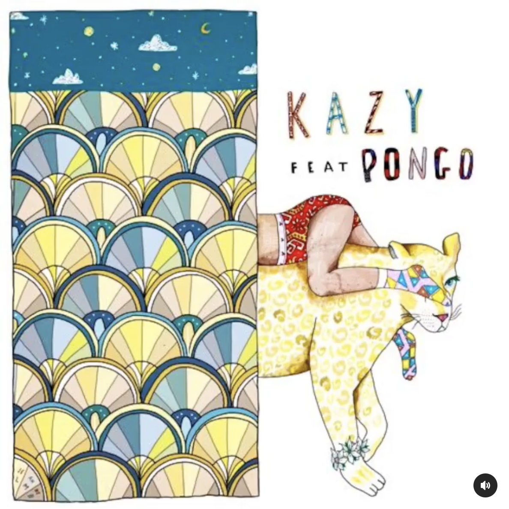

---------------------------------------

I am an applied statistician, social science researcher, and data analyst. I am currently a research associate at the *Universidad Carlos III de Madrid* working on the [EFFORT project](https://www.effort-project.eu/).

On the side, I like to teach, cook, [take (and develop my own!) photos](https://photos.app.goo.gl/YBSiTp9PrWmGvBQt5), play guitar, and coach soccer.  

## Work

- While at [Acumen/The SPHERE Institute](https://www.acumenllc.com/), I worked on large-scale epidemiological studies surveiling the Medicare population in real-time to detect elevated risk of adverse effects to the seasonal flu vaccine. If the technical details of this interest you, you can read all about them in [this publication](https://doi.org/10.1093/infdis/jiaa543) in the Journal of Infectious Diseases.

- I am a big fan of simulation studies (see [this publication](https://doi.org/10.1002/pds.4807) in Pharmacoepidemiology & Drug Safety from my time at Acumen). For my master's course in macroeconomics, I investigated [the effect of inflationary expectations on money demand](https://rpubs.com/madelineswarr/911232), simulating three different economies under Cagan's model of inflation to understand how and to what extent rational updating of expectations might only exacerbate inflationary issues.

- Inspired by my real-world observations living in Lavapiés, the multicultural center of Madrid, [my master's thesis](masters_thesis.html) looked at what impact initial settlement patterns of recently-arrived persons, often determined with little understanding of local contexts and dictated by broader forces of the migratory network, have on economic integration. Here's a GIF I made which visualizes the period of rapid influx of immigration in Spain from 1998 to 2021.

- The EFFORT project uses experimental data collected from a large sample of fifth graders in Madrid and Berlin to assess the effects of social, economic, and motivational contexts on executive functioning. Watch me presenting the work I've done looking at gender effects [here](https://youtu.be/kkl-3iRxezs?si=unubnITj7J2767kM&t=2235).

## Other
- From 2019 to 2021, I worked as a teacher in a public high school in Madrid implementing the Global Classrooms program. Read about the program and my experience with it [here](https://madelineswarr.wixsite.com/moocfinalproject).

- Since 2021, I have been volunteering as an English teacher and soccer coach for the [Dragones de Lavapiés](https://dragonesdelavapies.com/), a grassroots soccer club with an incredible mission. If you're interested in learning more or collaborating with us, please reach out!  

- As a music lover, I collaborated with [Rock With This/theXchange](https://www.thexchange.live/) writing music reviews of songs we thought were worth sharing with the world. See the links below for some of my curations!

<table>
<tr>
	<td>
		 
		<a href="https://www.instagram.com/reel/Bw0K7--gOrr/" class="econ-link">Old Bone (Jim-E Stack remix) by Wet</a>
	</td>
	<td>
		 
		<a href="https://www.instagram.com/reel/BwST9dRAR2y/" class="econ-link">L.M.F. by Smino</a>
	</td>
	<td>
		 
		<a href="https://www.instagram.com/p/Bv9w-WZA-y8/" class="econ-link">Loose Ends (feat. Jorja Smith) by Loyle Carner</a>
	</td>
</tr>
<tr>
	<td>
		 
		<a href="https://www.instagram.com/reel/B1qDv-aHIOI/" class="econ-link">Work (feat. PONGO) by Kazy Lambist</a>
	</td>
	<td>
		 
		<a href="https://www.instagram.com/reel/Bxp_FgsAAU2/" class="econ-link">Cola by Arlo Parks</a>
	</td>
	<td>
		 
		<a href="https://www.instagram.com/reel/BxVgxo8gMnV/" class="econ-link">Pressure (feat. Major Lazer) by Chase & Status</a>
	</td>
</tr>
