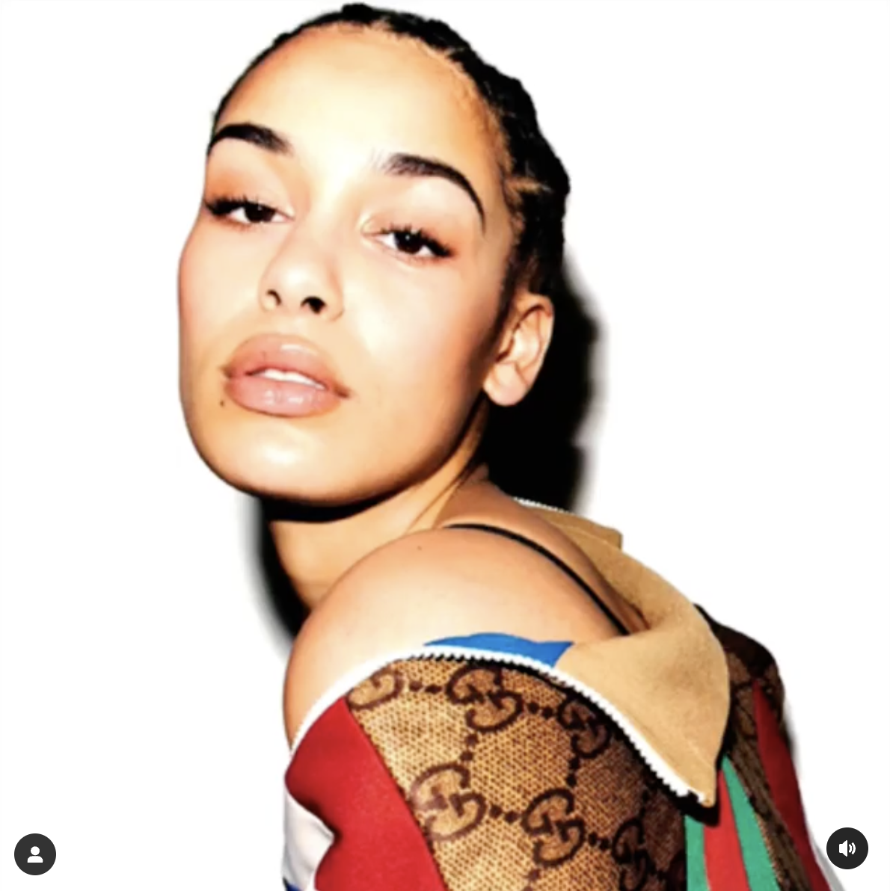

---------------------------------------
```{r setup, include=FALSE}
knitr::opts_chunk$set(echo = FALSE)
knitr::opts_chunk$set(warning = FALSE)
knitr::opts_chunk$set(message = FALSE)
```

```{r}
library(vembedr)
```

### <u></u>

- I enjoy doing film photography, developing my own photos whenever I have the time and space. You can see some of my photos and prints [here](https://photos.app.goo.gl/YBSiTp9PrWmGvBQt5).

- From 2019 to 2021, I worked as a teacher in a public high school in Madrid implementing the Global Classrooms program. Read about the program and my experience with it [here](https://madelineswarr.wixsite.com/moocfinalproject).

- Since 2021, I have been volunteering as an English teacher and soccer coach for the [Dragones de Lavapiés](https://dragonesdelavapies.com/), a grassroots soccer club with an incredible mission. If you're interested in learning more or collaborating with us, please reach out!  

- As a music lover, I collaborated with [Rock With This/theXchange](https://www.thexchange.live/) writing music reviews of songs we thought were worth sharing with the world. See the links below for some of my curations!

<table>
  <tr>
  	<td>
  		<br>
  		<a href="https://www.instagram.com/reel/Bw0K7--gOrr/" class="econ-link">Old Bone (Jim-E Stack remix) by Wet</a>
  	</td>
  	<td>
  		<br>
  		<a href="https://www.instagram.com/reel/BxVgxo8gMnV/" class="econ-link">Pressure (feat. Major Lazer) by Chase & Status</a>
  	</td>
  	<td>
  		<br>
  		<a href="https://www.instagram.com/p/Bv9w-WZA-y8/" class="econ-link">Loose Ends (feat. Jorja Smith) by Loyle Carner</a>
  	</td>
  </tr>
  </tr>
</table>
